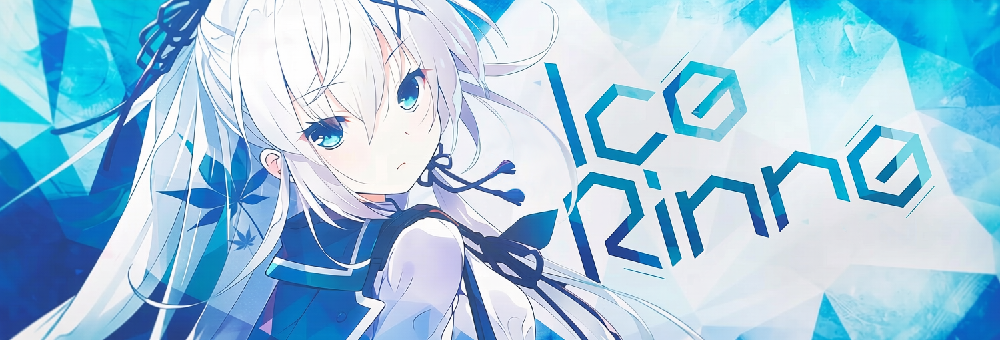

  

  <em>"Crystalizing moments in the cycle of code — between exploration and permanence."</em>

  

  

---

### 🛠️ Tech Stack & Tools

  
  
  
  

 

### 📈 GitHub Stats

  
  

 

### 🐍 Contribution Snake

  <picture>
    <source media="(prefers-color-scheme: dark)" srcset="https://raw.githubusercontent.com/hanbinhsh/hanbinhsh/output/github-contribution-grid-snake-dark.svg">
    <source media="(prefers-color-scheme: light)" srcset="https://raw.githubusercontent.com/hanbinhsh/hanbinhsh/output/github-contribution-grid-snake.svg">
    
  </picture>

 

  
<b>📬 Reach Me</b>

   
  <ul>
    <li><b>mail:</b> <a href="mailto:hanbinhsh@qq.com">hanbinhsh@qq.com</a></li>
    <li><b>qq:1024622242</b> </li>
  </ul>

